# chess

Simple chess application to play against a very smart computer and with very bad graphics (that's a trend and something to be proud of).

# Installation

- Clone the repo: `git clone git@github.com:Knoblauchpilze/chess.git`.
- Clone dependencies:
    * [core_utils](https://github.com/Knoblauchpilze/core_utils)
    * [maths_utils](https://github.com/Knoblauchpilze/maths_utils)
- Go to the project's directory `cd ~/path/to/the/repo`.
- Compile: `make r`.

Don't forget to add `/usr/local/lib` to your `LD_LIBRARY_PATH` to be able to load shared libraries at runtime. This is handled automatically when using the `make r` target (which internally uses the [run.sh](https://github.com/Knoblauchpilze/chess/blob/master/data/run.sh) script).

# General principle

The application is structured in various screens:
* the home screen
* the load game screen
* the side selection screen
* the game screen

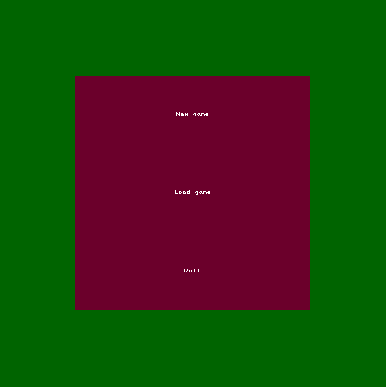

Each screen serves a purpose and they can be reached starting from one to the other. The general idea is to select a game (either loading it from an existing save or creating a new one), then pick a side and finally play the game.

# Load a game

TODO: Add that in case it is implemented.

# Select a side

When creating a new game, the user can pick on of the side. The other will be played by an AI, which will automatically play as soon as the player does so. The rest of the processes should be adaptative to whatever side is picked.

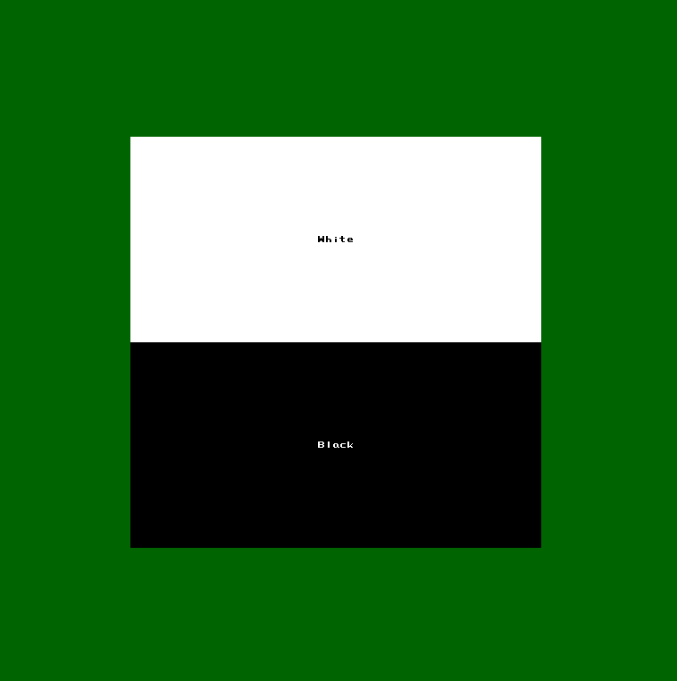

# The game

Once the user picked a side, the main game view is displayed. This view is representing a board in the direction where the user is playing (so it's adapting based on whether the player is white or black).

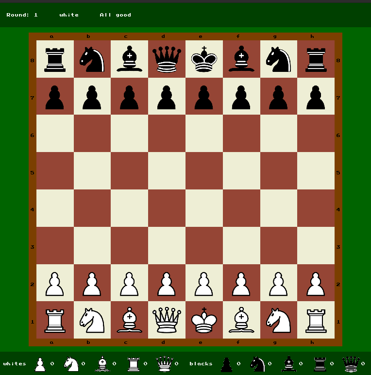
_Game view as white_

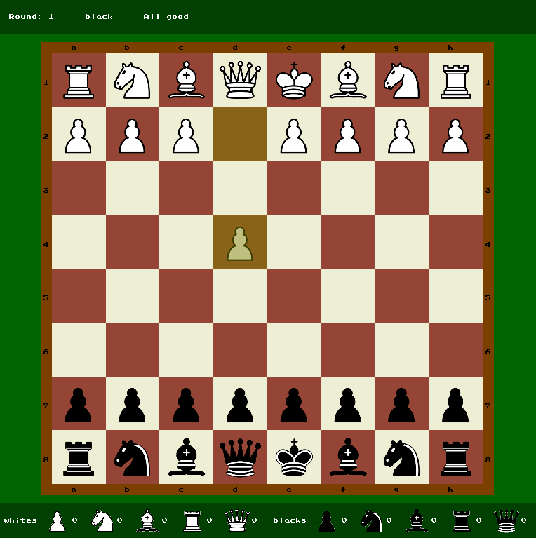
_Game view as black_

## Status panel

The user can see the status panel which displays information about the current state of the game, such as the round, whether the player is in check or in checkmate.

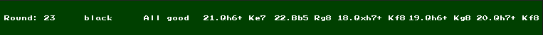

Only the last five moves are displayed.

## Captured pieces

The user can also see the captured pieces by both sides on the bottom of the window.

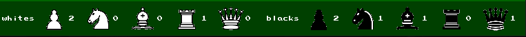

Each time a new piece is captured, it is displayed in here to give an overview of who might be winning.

## Board

The board is the main part of the application window. It displays indication about the files and rows to help with the decision and a certain number of hints.

### Pick a move

In order to make a move, the user should first click on a piece, and then select a destination. The game displays some information about the possible location in a blue overlay.

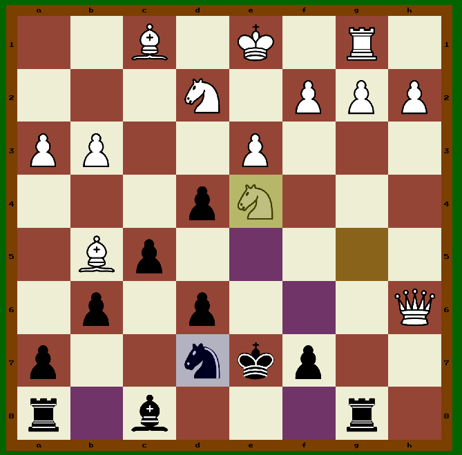

### Last move

To remember what was last played, the app also displays the information about the last move with a yellow overlay.

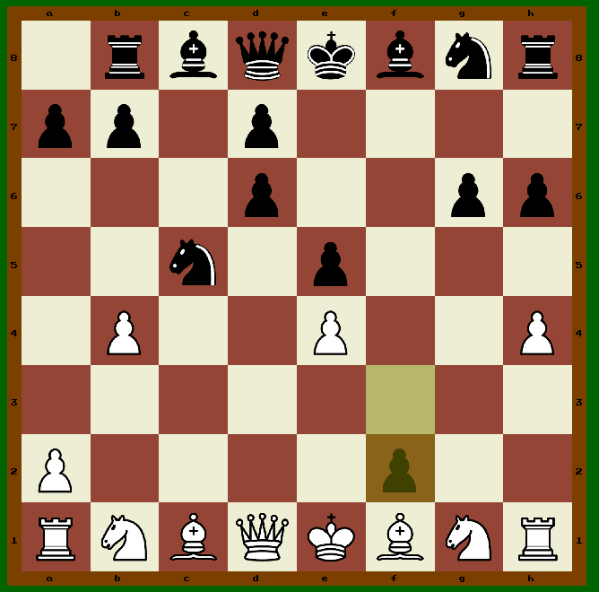

### Alerts

Whenever the situation requires it, the application will display alerts to inform the user about it. This includes being:
* in check
* in checkmate
* the opponent in stalemate
* the opponent in checkmate

For each situation the game will assess whether the game is over or not and move on to the next logical screen.

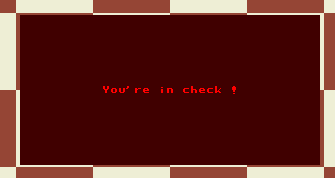
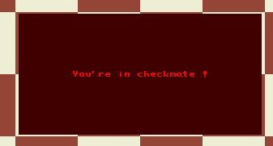
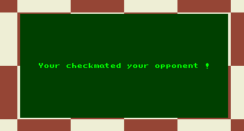

# Ending the game

The user can exit the app at any moment using the `Escape` key.

In case the game ends either because the player checkmated the opponent, reached a position of stalemate or lost, the game will go back to the main menu and allow the user to either start a new game or quit the application.